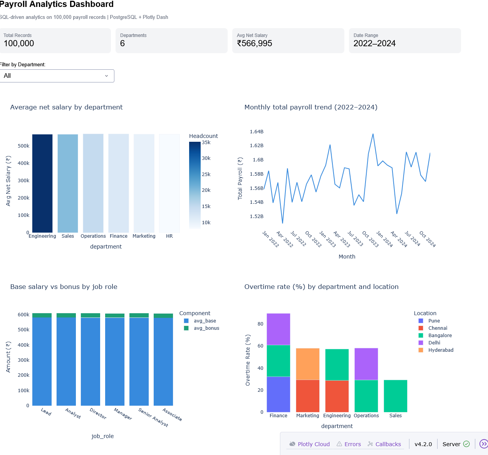

# SQL Payroll Analytics Dashboard

ETL pipeline + advanced SQL analytics on 100K synthetic payroll records.
PostgreSQL backend with indexed query optimization, Plotly Dash frontend.

## Screenshots

## Key results

| Query | Before index | After index | Speedup |
|---|---|---|---|
| Dept payroll sum | 39.0ms | 30.4ms | 1.3x |
| Overtime filter  | 13.0ms | 0.7ms  | 18.6x |
| Monthly trend    | 24.9ms | 35.2ms | 0.7x* |
| Location filter  | 14.3ms | 7.5ms  | 1.9x |

*Monthly trend sequential scan outperformed index scan for full-table
aggregation — PostgreSQL query planner made the correct decision.

## Key findings from data
- Engineering is largest dept — 35,166 employees, 35.13% of total payroll
- Overtime anomaly detection flagged EMP32363 with Z-score 3.72
- Bangalore highest overtime rate at 28.5%, Hyderabad lowest at 27.4%
- Salary quartile shows 2x gap — bottom quartile ₹387K vs top ₹755K
- Monthly payroll stable within ±1.6% growth — no anomalous spikes

## SQL techniques used
- Window functions: RANK(), LAG(), SUM() OVER(PARTITION BY), NTILE()
- CTEs for multi-step aggregation and Z-score anomaly detection
- PERCENTILE_CONT for salary distribution analysis
- EXPLAIN ANALYZE for query execution plan verification
- Composite indexes on high-cardinality filter columns

## Setup
1. Install PostgreSQL 16, create database: payroll_db
2. Copy db_config_example.py → db_config.py → add your password
3. pip install -r requirements.txt
4. python main.py  ← runs entire pipeline in one command